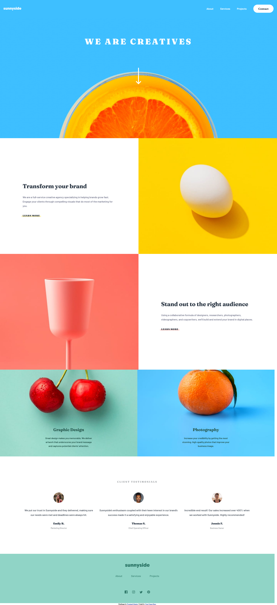

# Frontend Mentor - Sunnyside agency landing page solution

This is a solution to the [Sunnyside agency landing page challenge on Frontend Mentor](https://www.frontendmentor.io/challenges/sunnyside-agency-landing-page-7yVs3B6ef). Frontend Mentor challenges help you improve your coding skills by building realistic projects.

## Table of contents

- [Overview](#overview)
  - [The challenge](#the-challenge)
  - [Screenshot](#screenshot)
  - [Links](#links)
- [My process](#my-process)
  - [Built with](#built-with)
  - [What I learned](#what-i-learned)
  - [Continued development](#continued-development)
  - [Useful resources](#useful-resources)
- [Author](#author)
- [Acknowledgments](#acknowledgments)

## Overview

### The challenge

Users should be able to:

- View the optimal layout for the site depending on their device's screen size
- See hover states for all interactive elements on the page
- Mobile: Toggle the nav bar on and off by tapping on the hamburger menu.

### Screenshot

### Links

- Solution URL: [Sunnyside Agency](https://fem-sunnyside-agency.onrender.com/)
  Hosted using [Render](https://www.render.com);

## My process

### Built with

- Semantic HTML5 markup
- CSS custom properies (using SCSS)
- Flexbox
- Mobile First Workflow

### What I learned

#### The importance of starting with mobile first

This is actually the second time I attempted this project. I had to scrap the first one. When I did the first one, I jumped right into the desktop design. When it was time to work on mobile, it was much harder to get things to where they needed to go.

This time, I sort of worked on both in tandem. I coded each section to the specs of mobile. Then, once the mobile version was done, I made it responsive.

And really, I should be doing mobile first regardless because so many more people are using phones to browse the web than desktop it seems.

#### Using math and scss together.

I never knew that things like `calc()` didn't work as expected in SCSS. Now I know that if I ever want to use `calc()` (which I do somewhat often), that I will also need to make sure I use interpolation along with adding `@use "sass:math";` to my style sheets.

#### Windows scroll bars can sometimes mess with the width of your project

I was having an issue with my project for a long time, where it was ignoring my rule of `100vw` and I was getting sections that extended past that, causing overflow on the x-axis. I reached out to a web dev friend of mine, [Zaydek](https://github.com/zaydek), and he noticed that the amount that was overflowing was the same amount as the width of the scrollbar. He was able to point me in the right direction as to how to fix this.

I was able to get it fixed thanks to him. I am still not entirely sure what caused it, but it seems to work as expected now! Thanks buddy!

### Continued development

- I want to continue focusing on SCSS. I really like the organization of it, and I would like to get much better at using it.
- Something else I want to get better with is working on some positioning issues. I noticed with this project, that overflow and positioning seemed to be a common issue I had to keep debugging.

### Useful resources

- [Using Calc with SCSS](https://sass-lang.com/documentation/syntax/special-functions#calc-clamp-element-progid-and-expression) - I never really knew that you couldn't outright use SCSS and `calc()` together without some extra steps. This showed me that I needed to use interpolation using `#{$variable}` along with `@use "sass:math";`.

## Author

- Blog - [Hashnode](https://russdevs.hashnode.dev/)
- Frontend Mentor - [@rperry99](https://www.frontendmentor.io/profile/rperry99)
- Twitter - [@RussDevs](https://twitter.com/russdevs)

## Acknowledgments

I want to give a shoutout to my friend [Zaydek](https://github.com/zaydek). I was having a weird issue with the page overflowing on the X axis and I couldn't figure out why. He was able to tell me that the issue was a windows specific one, and was able to point me in the right direction to fixing it.
